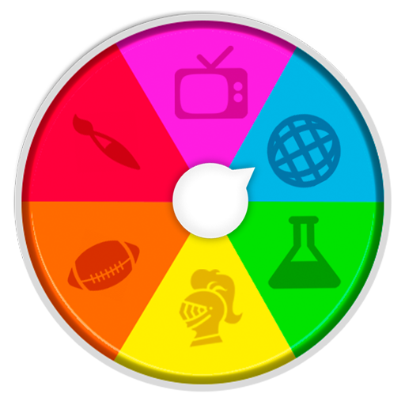
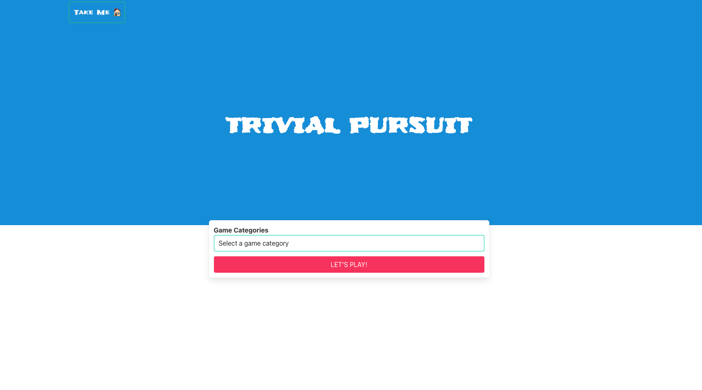
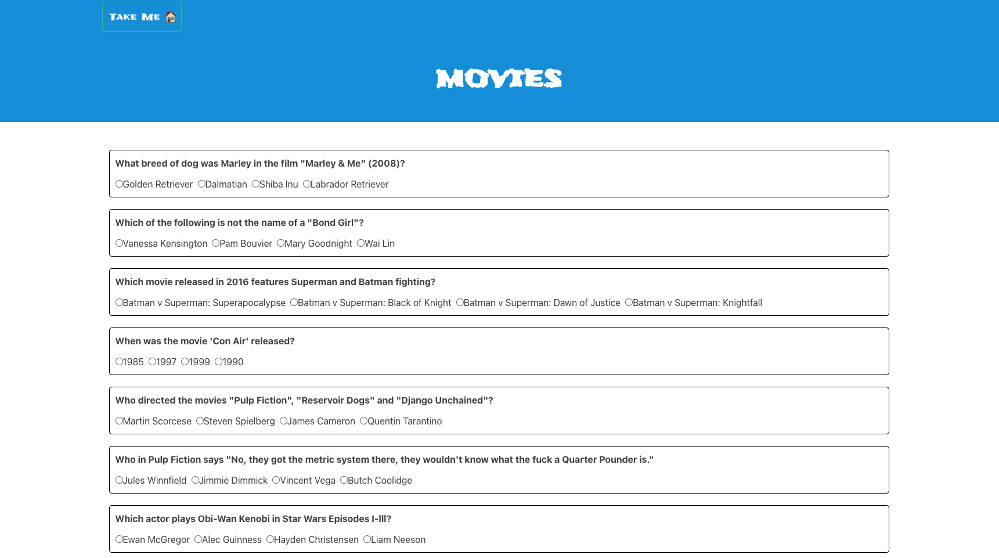
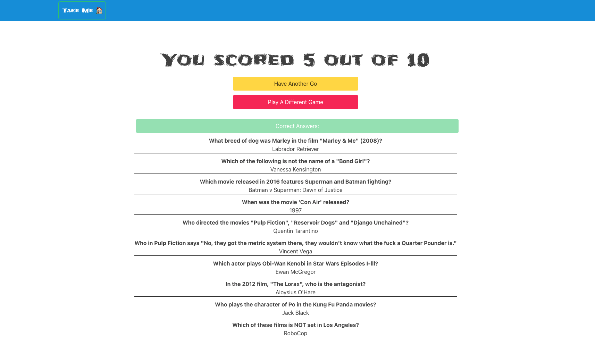

#  Project-2: Trivial Pursuit 

#### General Assembly SEI Project-2 | Trivial Pursuit | React app | 28-hours | Pair-programming

Deployed version of our app: https://trivialpursuit-ga.netlify.app/


## Collaborator

- Paolo Zuccaro - [/pololo16](https://github.com/pololo16)


## Overview

This was my second project on the General Assembly SEI. We were divided up in pairs and given 28 hours to build a React.js app which consumed a public API. 

With my teammate we started talking about what kind of an app we would enjoy building and being fans of the board game Trivial Pursuit we decided to build a quiz API. 


## Brief
* **Consume a public API** – this could be anything but it must make sense for your project.
* **Have several components** - At least one classical and one functional.
* **The app can have a router** - with several "pages", this is up to your discretion and if it makes sense for your project.
* **Include wireframes** - that you designed before building the app.
* **Be deployed online** and accessible to the public.

## Planning
After deciding on an API we worked together to get the rest of the functionality. We decided on what was a priority and what was a stretch goal we could discard if necessary. This was important to me as I struggled with this on my last project. Having a clear to-do list made it easy for us to see what we needed to do together and on which features we could work on our own. Having less than 2 weeks of experience with React, we felt better to go through it together.

## Process
We followed along the user journey as we built our project. First, we built the homepage where you could select and go to a different quiz category, which would then display the different data we were requesting from the API.

Then we worked on the actual quiz and then we built the results page where we passed on data from the game page to display the correct answers for all the questions.

Finally we worked individually on improving the UX. I worked on adding a navigation bar to allow the user to go back to the homepage whenever they wanted and the ability to play again in the same category or choose another one in the results page.

## Screenshots


##### Homepage




##### Quiz screen




##### Result display




## Challenges
We had two big challenges with this project. Our chosen API returned the symbols such as & or '' with their HTML name codes which made our quizzes very hard to read and play. This being a Hackhaton and time being an issue, we had to get creative and escaped this issue with `dangerouslySetInnerHTML`:

```javascript 
<h2 dangerouslySetInnerHTML={ { __html: question.question } }>
```

## Wins

The biggest win I had with this project was determining the result of a quiz. Working with an external API, we didn't get to choose how we were getting the data and had to find creative ways to work around issues to get the result we wanted. 

For UX purposes we wanted a layout that allowed the user to easily change their answer which made it difficult for us to calculate the result when the form was submitted. 

The API gave us the answers in two arrays. One had the correct answer for that question and the other had all the incorrect answers. To work around our issue, every time the user clicked on an option we ran a check for two things. First, we checked if the chosen answer was correct and if so pushed it to a third array. If the chosen answer wasn't the correct one, then we checked if the correct answer was already in the third array. This meant that the user originally chose the correct answer but now was changing to an incorrect one. In that case we removed the correct answer for that question from the third array. In the end the length of the third array gave us the final score of the user. 

###### If the user chose the correct answer, spread and add to the `answers` array:  
``` javascript
function handleCorrectAnswer(e) {
    const choice = e.target.innerHTML

    if (correctAnswers.includes(choice) && (!answers.includes(choice))) {
      setAnswers([...answers, choice])
    } 
  }
```

###### If the answers was incorrect, run the check to see if it would change the score:
``` javascript
  function handleWrongAnswer(e) {
    const correctAnswer = e.target.dataset.answer
    if (answers.includes(correctAnswer)) {
      setAnswers(answers.filter(answer => answer !== correctAnswer))
    }
  }
```
###### Final score was the length of the `answers` array:  
``` javascript
  function handleResults(e) {
    e.preventDefault()
    history.push('/results', { score: answers.length })
  }
```

## Key Learnings

The project was invaluable in terms of working as a pair and learning how other people approach code.

We also didn't want to use Bulma at first but then decided to switch as we had limited time, which taught us to be adaptable. 

I believe I didn't spend enough time on planning with my last project and started coding too fast which ended up slowing me down. Having limited time this time around pushed us to plan well in a way. We decided what our MVP was and what were our stretch goals, which features were priority and which were "nice to have". This kept us focused as we had a clear to-do list.

## Future Features

* If I had more time I would have liked to add difficulty levels. The API had the option to return games based on different difficulties but our time constraint prevented us from exploring this option.

* We would have also liked to add a two-player version that would also display a winner in the end.

## Version II

After completing this project and knowing a lot more about React after a few months of practice, I felt like I could tackle some of the improvements we wanted to make. I kept the entire project the same from the user's point of view and changed two features that we were not the happiest with, but had to prioritise due to time constraints:

* Originally, we had a separate component for all of the quiz categories. This felt against React to us as we were building this but due to time concerns prioritised a working product. I refactored this so now we have a single game component which makes an `axios` request based on the user's choice and displays the correct data.

``` javascript
const { gameCategory } = useParams()

const gameCategories = [
    { name: 'books', id: 10 }, 
    { name: 'general knowledge', id: 9 }, 
    { name: 'sports', id: 21 }, 
    { name: 'movies', id: 11 }, 
    { name: 'music', id: 12 }, 
    { name: 'celebrities', id: 26 }, 
    { name: 'history', id: 23 }, 
    { name: 'science and nature', id: 17 }
]

const currentGameCategory = gameCategories.filter( category => {
  return category.name === gameCategory
})

const gameId = currentGameCategory[0]?.id
```

* Because we got the answers to questions from the API in two arrays, the way we displayed them always had the correct answer as the first choice. We played around with the UI to make it not obvious to the user, which I am very happy about; but now that I had more knowledge and more than 28 hours I refactored this so they would be displayed randomly.

``` javascript
const questionsToDisplay = initialQuestions.map(question => {
  const indexToAddCorrectAnswer = Math.floor(Math.random() * 4)
  const allAnswers = question.incorrect_answers
  //Mutating the array and adding the correct answer to a random index:
  allAnswers.splice(indexToAddCorrectAnswer, 0, question.correct_answer)
  const newQuestion = { ...question, allAnswers }
  return newQuestion
})
```